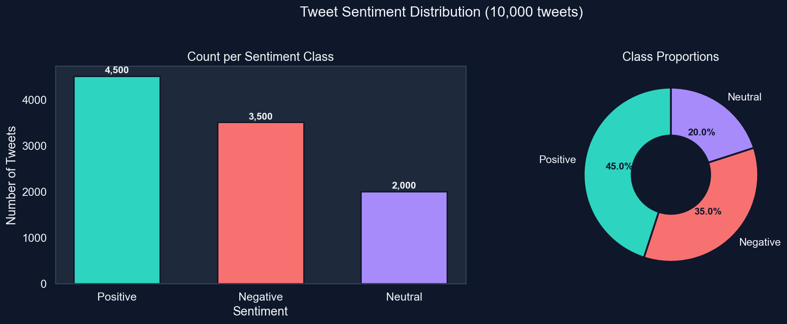

Twitter Sentiment Analysis Pipeline 



A comprehensive, end-to-end Machine Learning pipeline utilizing Natural Language Processing (NLP) to predict the sentiment of social media text. 

This repository contains everything from custom dataset generation and advanced text preprocessing, to training a TF-IDF & Logistic Regression model. It culminates in a dynamic Web App dashboard built with Flask and styled with modern web technologies.

## Key Features
- **Data Preprocessing**: Custom pipelines utilizing intelligent tokenization, stopword removal, and lemmatization for pristine training data.
- **Machine Learning Model**: Powered by a finely-tuned Logistic Regression algorithm and TF-IDF vectorization for high-accuracy predictions.
- **Deep Analytics**: 8 custom analytics charts generated via Matplotlib & Seaborn tracking word clouds, sentiment distribution, text length correlation, and engagement tracking.
- **Interactive Web Interface**: A sleek, user-friendly frontend dashboard (HTML/CSS + Flask) that evaluates text sentiment in real-time.

## Technology Stack
- **Languages**: Python, HTML, CSS
- **Machine Learning**: Scikit-Learn, NLTK, Pandas, Numpy
- **Data Visualization**: Matplotlib, Seaborn, WordCloud
- **Framework**: Flask (Web Server)

## Analytics Highlights
Our training pipeline automatically exports performance metrics and deep-dive visuals directly into the `outputs/` directory.

1. `1_sentiment_distribution.png` - Overall breakdown of class balance.
2. `3_confusion_matrix.png` - Model evaluation and accuracy charting.
3. `5_top_tfidf_features.png` - Discovers which keywords carry the most sentiment weight.
4. `6_word_clouds.png` - Visual representation of popular phrases across emotions.

## How to Run Locally

### 1. Requirements
Ensure you have Python 3.8+ installed. Install the required dependencies:
```bash
pip install -r requirements.txt
```

### 2. (Optional) Retrain the Model
If you'd like to experiment with the model yourself from scratch:
```bash
python main.py
```
This script handles the full pipeline: it generates the dataset, preprocesses the data, trains the model (`train_model.py`), saves `sentiment_model.pkl`, and renders the graphs (`visualize.py`).

### 3. Launch the Web Application
Start up the interactive Flask server by running:
```bash
python app.py
```
Then, open your browser and navigate to `http://127.0.0.1:5000` to interact with the model in real time!

---
> *This project was developed to showcase an end-to-end understanding of natural language data pipelines, model deployment, and visual analytics.*
